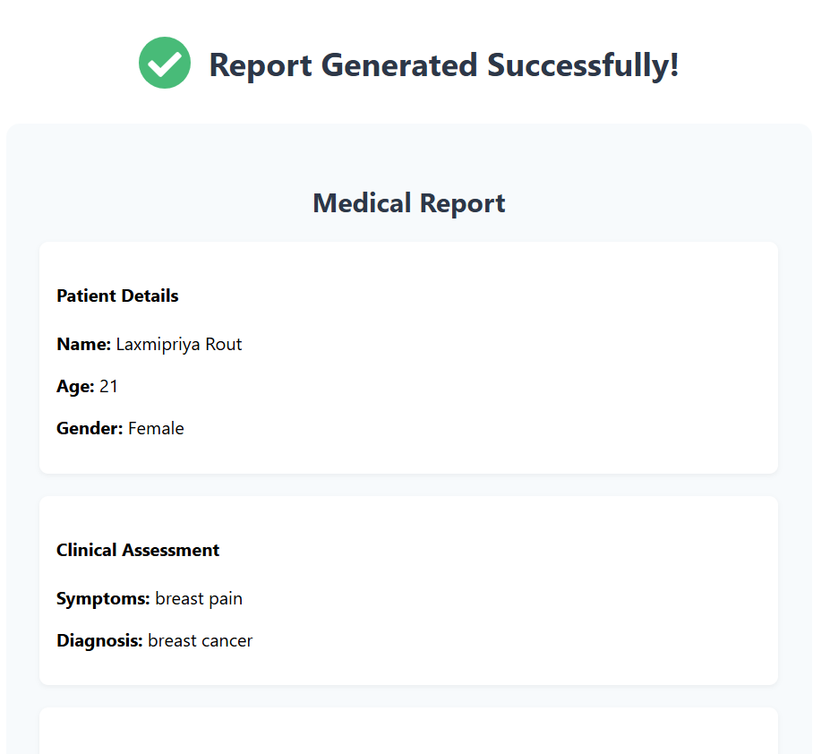
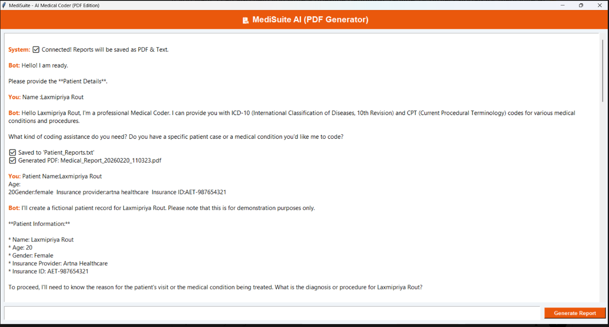

# 🏥 MediSuite AI – Intelligent Medical Coding & Report Generation System

## 📌 Overview

**MediSuite AI** is an AI-powered healthcare assistant designed to automate medical coding and report generation. The system analyzes patient details and automatically generates **ICD-10 diagnosis codes**, **CPT procedure codes**, and structured **medical reports in PDF format**.

This project helps reduce manual effort, improve accuracy, and streamline healthcare documentation.

---

## 🎯 Objectives

* Automate medical coding process
* Reduce human errors in healthcare documentation
* Save time for doctors and medical coders
* Generate professional medical reports instantly

---

## ⚙️ Features

✔ Collect patient information (name, age, symptoms, diagnosis)
✔ Analyze medical input using AI techniques
✔ Generate ICD-10 diagnosis codes
✔ Generate CPT procedure codes
✔ Create structured medical reports
✔ Export reports as PDF files
✔ Simple and user-friendly interface

---

## 🧠 Technology Used

### 🔹 Frontend

* Tkinter (Python GUI)

### 🔹 Backend

* Python

### 🔹 AI Techniques

* Rule-Based Expert System
* Natural Language Processing (NLP)
* Keyword Extraction

### 🔹 Libraries

* ReportLab (PDF generation)
* Pandas (data handling)
* Groq (optional / future use for LLM integration)

---

## 🏗️ System Architecture

User Input → Data Processing → NLP Analysis → Code Mapping → PDF Generation → Output Report

---

## 🚀 How It Works

1. User enters patient details
2. System processes medical information
3. NLP extracts important keywords
4. Matches with ICD-10 & CPT database
5. Generates medical codes
6. Creates a structured PDF report
7. User downloads the report

---

## 📂 Project Structure

```
MediSuite-AI/
│
├── main.py
├── ai_model.py
├── templates/
├── reports/
├── data/
│   ├── icd_codes.csv
│   └── cpt_codes.csv
├── requirements.txt
└── README.md
```

---

## ▶️ Installation & Setup

### Step 1: Clone the repository

```
git clone https://github.com/your-username/medisuite-ai.git
cd medisuite-ai
```

### Step 2: Install dependencies

```
pip install -r requirements.txt
```

### Step 3: Run the project

```
python main.py
```

---

## 📊 Sample Output

* ICD-10 Codes: R50.9 (Fever), J20.9 (Bronchitis)
* CPT Codes: 99213 (Office Visit)
* Generated PDF: Medical Report

---
## 📸 Project Demonstration

### 🖥️ User Interface
The system provides a user-friendly interface to enter patient details and interact with the AI medical coding assistant.



---

### 📄 Generated Medical Report
The system automatically generates a structured PDF report with ICD-10 and CPT codes.



---

### 🔍 Output Description
The generated report includes:
- Patient details  
- Diagnosis information  
- ICD-10 codes (disease classification)  
- CPT codes (procedure classification)  
- Structured professional medical report  

This demonstrates how MediSuite AI automates medical coding and report generation.

This demonstrates the automation of medical coding and report generation using AI.
## 🧪 Limitations

* Uses rule-based logic (not fully trained ML model)
* Limited to predefined medical codes
* Requires manual input

---

## 🔮 Future Enhancements

* Integrate Machine Learning models
* Add Large Language Model (LLM) support using Groq API
* Develop web-based version (Flask/React)
* Add database (MySQL) for patient records
* Implement user authentication system

---

## 🏥 Applications

* Hospitals and clinics
* Medical coding assistance
* Healthcare documentation systems
* Medical training and education

---

## 👩‍💻 Author

Laxmipriya Rout

---

## 📜 License
MIT LICENSE
This project is for educational purposes only.
